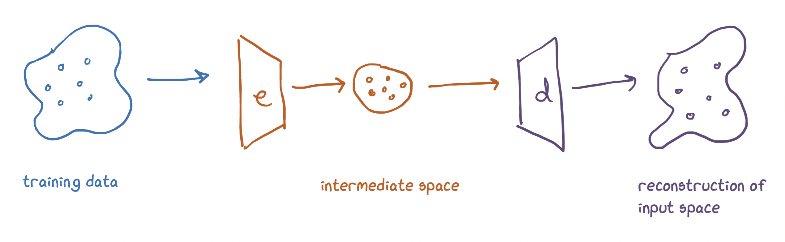
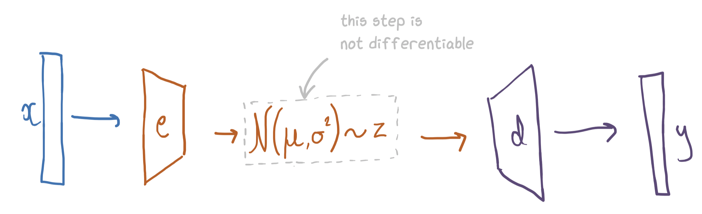

```python
import torch 
import torch.nn as nn

torch.manual_seed(0);
```

# Variational Autoencoders

The basic setup for VAEs is this:



We parameterise the encoder and decoder as neural networks. We'd like to later use the decoder to sample things (e.g. images of faces), so we need that intermediate space to be something we know how to sample from (e.g. a Gaussian). 

One way to do this is to just have the output of the encoder be the parameters to a Gaussian:


```python
x = torch.rand(5)
encoder = nn.Linear(5, 2) 

mu, var = encoder(x) 

intermediate_representation = normal(mu, var).sample(1)
```

This intermediate representation is what gets fed into the decoder. 

The problem is that our network pipeline now looks like this:



The part where we sample the intermediate representation from the normal distribution is not differentiable, so we won't be able to get gradients back to our encoder. 

To solve this we use the reparameterisation trick. 

## The Reparameterisation Trick 

The reparameterisation trick is really simple: we just take a sample from a unit Gaussian and add this into our model as an input. Specifically, we sample a value, multiply it by $\sigma$ and add $\mu$. 

I.e. if we have a sample $x$ from a normal distribution with mean 0 and variance 1 then $\sigma x + \mu$ will be a sample with mean $\mu$ and variance $\sigma^2$.

A picture:


Note we still can't backpropagate through sampling, but now we don't need to, the sample is just another input (like the image) to our model. So we could get a gradient for the specific value that we sampled, but we don't need to backpropagate any further.


```python
encoder = nn.Linear(5, 2)
decoder = nn.Linear(1, 5)

x = torch.rand(5)

z = encoder(x)
h = torch.rand(1)
z = (z[1] * h) + z[0] # reparameterisation trick
decoder(z)
```


    tensor([ 1.0016, -0.3996, -0.2622,  0.3476,  0.6642], grad_fn=<AddBackward0>)


Now we have a way to do the forward pass, we need a loss function.

## The ELBO loss function


```python

```
